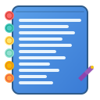

# Pure Chrome Extension Notepad

A beautiful, offline-only notepad Chrome extension with macOS-inspired design. Keep your notes private and accessible anywhere on the web with a floating, draggable interface.



## 🎯 Features

### **Interactive & Customizable UI**
- **Draggable** – Move anywhere on screen by dragging the title bar
- **Resizable** – Adjust width/height with the resize handle
- **Adjustable Opacity** – Control transparency from 50% to 100%
- **macOS-Style Design** – Native traffic light buttons and frosted glass effect
- **Dark/Light Mode** – Auto-detects system preference with manual override

### **Note Management**
- **Auto-Save** – Notes automatically saved every 5 seconds
- **Multiple Notes** – Create, switch, and organize unlimited notes
- **Search** – Instantly filter notes by title or content
- **Export** – Download notes as `.txt` or `.md` files
- **Cross-tab Sync** – Notes sync across all browser tabs

### **Text Editing**
- **Markdown Support** – Use `**bold**` and `*italic*` formatting
- **Font Customization** – Adjustable font size (10px-24px)
- **Live Word Count** – Track words and characters in real-time
- **Rich Text Features** – Bold, italic, and formatting toolbar

### **Keyboard Shortcuts**
- `⌘+Shift+N` (or `Ctrl+Shift+N`) – Toggle notepad visibility
- `⌘+B` – Make selected text bold
- `⌘+I` – Make selected text italic
- `⌘+S` – Save current note
- `⌘+F` – Search through notes
- `⌘+N` – Create new note

### **Privacy & Security**
- **100% Offline** – No external connections or cloud storage
- **Local Storage Only** – Uses Chrome's secure local storage API
- **No Data Collection** – Your notes never leave your browser
- **No Authentication** – Start writing immediately

## 🚀 Installation

### Developer Mode Installation

1. **Download the Extension**
   ```bash
   git clone <repository-url>
   cd pure-chrome-notepad
   ```

2. **Open Chrome Extensions**
   - Go to `chrome://extensions/`
   - Enable "Developer mode" (toggle in top-right)

3. **Load the Extension**
   - Click "Load unpacked"
   - Select the extension folder
   - The Pure Notepad icon should appear in your toolbar

4. **Start Using**
   - Click the extension icon in your toolbar
   - A new tab will open with the notepad interface
   - Start writing your first note!

### Chrome Web Store (Future)
*This extension will be available on the Chrome Web Store soon.*

## 📖 How to Use

### **Getting Started**
1. **First Launch**: Click the extension icon in your toolbar
2. **New Tab Opens**: The notepad opens in a dedicated tab
3. **Welcome Note**: Read the built-in welcome note for a quick tour
4. **Start Writing**: Click in the text area and begin typing
5. **Auto-Save**: Your notes are automatically saved as you type

### **Managing Notes**
- **Create New Note**: Click the `+` button or press `⌘+N`
- **Switch Notes**: Use the dropdown menu in the toolbar
- **Delete Note**: Click the trash icon (requires confirmation)
- **Search Notes**: Click the search icon or press `⌘+F`

### **Customization**
- **Move Window**: Drag the title bar to reposition
- **Resize**: Drag the bottom-right corner to resize
- **Settings**: Click the gear icon to adjust:
  - Opacity level
  - Font size
  - Theme (Auto/Light/Dark)
  - Auto-save preferences

### **Text Formatting**
- **Bold**: Select text and press `⌘+B` or use `**text**`
- **Italic**: Select text and press `⌘+I` or use `*text*`
- **Export**: Click export button and choose `.txt` or `.md` format

### **Window Controls**
- **🔴 Red Button**: Close/hide the notepad
- **🟡 Yellow Button**: Minimize the notepad
- **🟢 Green Button**: Maximize/restore the notepad

### **Keyboard Shortcut:**
- All keyboard shortcuts work within the notepad tab
- ⌘+B for bold, ⌘+I for italic, ⌘+F for search, etc.

## 🛠️ Development

### **Project Structure**
```
pure-chrome-notepad/
├── manifest.json          # Extension configuration
├── notepad.html           # Main notepad interface
├── notepad.css            # Notepad styling
├── notepad.js             # Notepad functionality
├── background.js          # Service worker
├── icon16.svg             # 16px SVG icon
├── icon48.svg             # 48px icon
├── icon128.svg            # 128px icon
└── README.md              # This file
```

### **Key Technologies**
- **Chrome Extensions API** – For storage and shortcuts
- **Vanilla JavaScript** – No external dependencies
- **CSS3** – Modern styling with backdrop-filter
- **SVG Icons** – Scalable vector graphics

### **Storage Structure**
```javascript
{
  notes: [
    {
      id: "unique-id",
      title: "Note Title",
      content: "Note content...",
      createdAt: timestamp,
      updatedAt: timestamp
    }
  ],
  currentNoteId: "active-note-id",
  settings: {
    theme: "auto|light|dark",
    fontSize: 14,
    opacity: 0.95,
    position: { x: 100, y: 100 },
    size: { width: 450, height: 600 },
    autoSave: true
  }
}
```

### **Building from Source**
1. Clone the repository
2. No build process required – it's vanilla JavaScript
3. Load directly in Chrome developer mode

### **Contributing**
1. Fork the repository
2. Create a feature branch
3. Make your changes
4. Test thoroughly in Chrome
5. Submit a pull request

## 🔧 Troubleshooting

### **Extension Not Loading**
- Ensure Developer mode is enabled in `chrome://extensions/`
- Check that all files are present in the folder
- Look for errors in the Chrome Extensions page

### **Shortcuts Not Working**
- Check if other extensions are using the same shortcuts
- Try reloading the extension
- Restart Chrome if needed

### **Notes Not Saving**
- Check Chrome storage permissions
- Ensure you have enough storage space
- Try creating a new note to test

### **Styling Issues**
- Clear browser cache
- Check if other extensions are interfering
- Try disabling other extensions temporarily

## 📱 Browser Compatibility

- **Chrome**: Fully supported (v88+)
- **Edge**: Supported (Chromium-based)
- **Brave**: Supported
- **Opera**: Supported (Chromium-based)
- **Firefox**: Not supported (different extension API)

## 🔒 Privacy Policy

Pure Notepad is designed with privacy as the top priority:

- **No Data Collection**: We don't collect any personal information
- **Local Storage Only**: All notes are stored locally in your browser
- **No Network Requests**: The extension never connects to external servers
- **No Analytics**: No tracking or usage analytics
- **Open Source**: Code is transparent and auditable

## 📄 License

MIT License - feel free to use, modify, and distribute.

## 🆘 Support

- **Issues**: Report bugs via GitHub issues
- **Feature Requests**: Submit enhancement ideas
- **Documentation**: Check this README for detailed usage

## 🎉 Acknowledgments

- Inspired by macOS design principles
- Built with modern web technologies
- Designed for privacy and simplicity

---

**Start writing your thoughts today with Pure Notepad!** ✍️